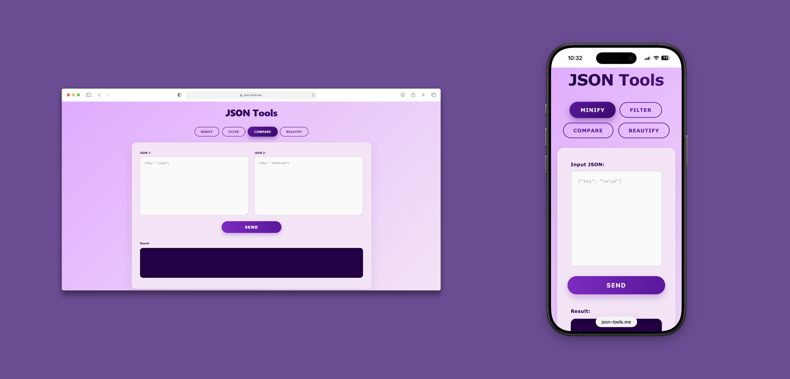

# JSON-Tools

### 🚀 [Live demo](https://www.json-tools.me)

**JSON Tools** is a web application designed for developers to perform text operations on JSON structures. It allows users to minify, beautify, filter and compare JSONs for differences. The application is fully containerized with **Docker** and deployed in cloud via **Azure**, featuring a **Spring Boot** backend and a **React** (Vite) frontend served by **Nginx**.

### 📸 Screenshots
<div align="center">
  
</div>

### 🛠 Technologies
| Categories | Technologies |
|----------|-------------|
| **Frontend** | [](https://skillicons.dev) |
| **Backend** | [](https://skillicons.dev) |
| **DevOps** | [](https://skillicons.dev) |
| **CI/CD** | [](https://skillicons.dev) |
| **Testing** | **JUnit**, **MockMvc** |

## ✨ Key Features
- **Minify**: Minify JSON to reduce data size.
- **Filter**: Exclude `key: value` by selected key.
- **Compare**: Compare JSON line by line and return differences. 
- **Beautify**: Format JSON to make it readable.

## 🐳 How to run locally (Docker)

You don't need Java or Node.js installed. Just **Docker**.

> Tip: You can install docker [here](https://www.docker.com/get-started/)

1. **Clone the repository**
```bash
git clone https://github.com/gruuubcioo/JSON-Tools.git
cd JSON-Tools
```

2. **Run with Docker Compose**
```bash
docker compose up --build
```

3. **Access the app**

> Open [http://localhost:3000](http://localhost:3000) in your browser


